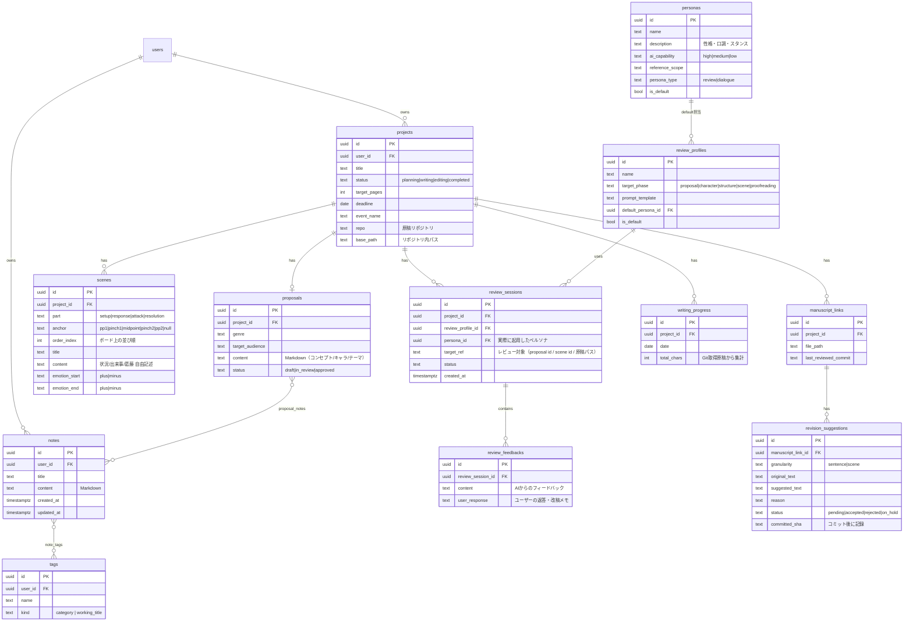

# 🐱 ネコノテAI（第二期）実装計画

作成日：2026年7月11日
バージョン：v3（2026-07-14 スケジュール改訂）
前提ドキュメント：ネコノテAI（第二期）要求仕様ドキュメント

---

## 1. ゴールとスケジュール前提

- **8/1（土）**：運用開始 — 実際の執筆準備（構想・企画・設計）に使い始められる状態
- **8/11（水・山の日）**：開発仕上げ — 全機能（校正フェーズ含む）が揃った状態
- 本日が7/11のため、**運用開始まで21日間**。全機能を8/1に揃えるのは依然難しいため、**「執筆プロセスの進行順」に機能を届ける**戦略を取る

### 7/13 改訂の前提（v2）

- Sprint 0・Sprint 1 が **7/13 時点で完了**（元計画の Sprint 1 完了予定 7/20 に対し約1週間先行）
- **Claude Fable 5 の無償利用が 7/20 午後（JST）まで**。以降はモデルが変わる前提
- **7/17（金）〜7/20（月・海の日）が4連休**で集中開発可能
- → 方針：**モデル性能が効く重量級タスク（レビューゲート・ビートボードD&D・GitHub連携＋AI校正・SPECインタビュー）を 7/20 までに前倒し**し、定型的な仕上げ（ダッシュボード・設定UI・UX改善）を 7/20 以降に残す

### 7/14 改訂の前提（v3）

- **実装計画の全機能が 7/14 時点で本番に揃った**（セッション⑲・対話型ペルソナのデプロイをもって Sprint 5 まで完了。8/11 目標に対し約4週間先行）
- 残るのは (a) SPECで意図的にスコープ外へ残置した機能、(b) 技術的負債、(c) 実データでの検証・運用
- → 方針：**7/14〜7/16（平日）で残置機能＋開発フロー自動化を消化**し、**じっくり時間のとれる 7/17〜7/20（4連休）を実データでのドッグフーディングに充てる**。8/1 運用開始・8/11 開発仕上げの枠組みはセーフティネットとして維持

### 段階的リリースの考え方
ユーザー（開発者本人）の12月COMITIA向け執筆は「構想→企画→設計→執筆→校正」の順に進む。アプリの機能も同じ順で完成させれば、**常に執筆プロセスの一歩先を開発が走る**形になり、8/1時点で校正フェーズが未完成でも運用を開始できる（校正が必要になるのは執筆が進んだ後のため）。

| リリース | 期日 | 使えるようになること |
|---|---|---|
| R1（運用開始） | 8/1 | 構想（ノート・タグ）＋企画（企画書・担当編集レビュー）＋設計（ビートボード・構成/シーンレビュー） |
| R2（仕上げ） | 8/11 | 校正（GitHub連携・AI校正・修正提案フロー）＋対話型ペルソナ全員＋ダッシュボード充実 |

---

## 2. 開発の基本方針

1. **縦に通す**：機能単位（構想→企画→設計→校正）で、UI→API→DB→AIまで一気通貫で完成させてから次へ。横展開（全画面の骨組みを先に作る等）はしない
2. **基盤は最初に固める**：認証・DBスキーマ・テーマ変数・エラーハンドリングはSprint 0で確定させる（第一期の「後付けで崩壊」の再発防止）
3. **毎日デプロイ**：その日の成果をVercelにデプロイして動作確認してから終了（「デプロイしたら寝る」ルール継続）
4. **スキーマファースト**：ER図 → Supabaseマイグレーション → Zodスキーマ → TypeScript型の順で、実装前にデータ構造を確定
5. **YAGNI**：パフォーマンス最適化・仮想化リストはMVPでは実装しない

---

## 3. データモデル（ER図 Draft）

**設計メモ**
- `ai_model_settings`（能力レベル→provider/model_idのマッピング）と`user_settings`（GitHub PAT暗号化保管、テーマ設定）は独立した設定系テーブルとして別途定義
- チャット履歴（対話型ペルソナ用）は`chat_threads`/`chat_messages`として追加予定。R3で詳細化
- 第一期の`characters`/`chapters`等の構造化テーブルは**作らない**（ノート＋テンプレートで代替）

---

## 4. 画面一覧（Draft）

| # | 画面 | 主な機能 | リリース |
|---|---|---|---|
| 1 | ログイン | Google認証 | R1 |
| 2 | ダッシュボード | プロジェクト一覧、進捗サマリー、今日のスケジュール | R1(簡易)→R2 |
| 3 | ノート一覧/検索 | タグ・仮タイトル絞り込み、全文検索 | R1 |
| 4 | ノートエディタ | Markdown編集、タグ付け、テンプレート挿入（プロットに落とし込む）、AI掘り下げ | R1 |
| 5 | プロジェクト作成/設定 | イベント・目標・締切・リポジトリ設定 | R1 |
| 6 | 企画書エディタ | 定型フォーマット編集、ノート紐づけ、担当編集レビュー（ゲート） | R1 |
| 7 | ビートボード | 4レーン＋転換点アンカー、シーンカードD&D、感情の起伏表示 | R1 |
| 8 | レビュー画面 | レビューセッション実行・履歴、フィードバック⇄返答 | R1 |
| 9 | 校正ワークスペース | 原稿読み込み、AI校正実行、提案の受入/拒否/保留、コミット | R2 |
| 10 | チャット（対話型ペルソナ） | アシスタント/マスターとの会話、メモ化 | R2（R1で簡易版検討） |
| 11 | 設定 | AIモデルマッピング、ペルソナ/プロファイル編集、GitHub PAT、テーマ | R1(最小)→R2 |

---

## 5. スプリント計画（v3：7/14改訂）

### Sprint 0：基盤構築 ✅ 完了（7/11〜7/12）
- リポジトリ作成、Next.js + TypeScript + shadcn/ui + Supabase + Vercel セットアップ
- **認証**：Supabase Auth（Google）をセッション管理含めて最初に実装・検証
- **テーマ**：next-themes + CSS変数でライト/ダーク切り替えの土台
- DBスキーマ全体（16テーブル＋RLS）をマイグレーション化、Zodスキーマ＋型生成、AppError＋共通ハンドラー
- ✅ 完了条件達成：ログインでき、テーマが切り替わる空アプリがVercelで動く

### Sprint 1：構想フェーズ ✅ 完了（7/12〜7/13）
- ノートCRUD、Tiptapエディタ（Markdown保存）、タグ付け、絞り込み一覧、ごみ箱
- テンプレート挿入機能（標準テンプレ4件シード）
- Vercel AI SDK（v7）導入、`ai_model_settings`解決、AI掘り下げ支援（サイドパネル・履歴DB保存）
- ✅ 完了条件達成：Notionの代わりにネコノテでネタメモが取れる

### Sprint 2：企画フェーズ＋レビュー基盤 ✅ 完了（計画を前倒しして完遂）
- 7/13（月）：SPECインタビュー（企画書エディタ＋レビュー基盤）。余力があればプロジェクトCRUD実装まで
- 7/14（火）：プロジェクトCRUD＋企画書エディタ（定型フォーマット、ジャンル/ターゲット層、ノート紐づけ）
- 7/15（水）：ペルソナ＋レビュープロファイルのシード（reviewer 4人）＋レビューセッションのゲートフロー
- 7/16（木）：E2E検証・デプロイで完了。**夜に Sprint 3 のSPECインタビュー（ビートボード）を前倒し実施**
- 平日のため無理をしない。7/16に終わらなくても、レビューゲートの反復部分だけ7/17朝に回せば連休計画は崩れない
- ✅ 完了条件：企画書を書いて担当編集のレビューゲートを回せる

### Sprint 3：設計フェーズ ✅ 完了（計画を前倒しして完遂）
- 7/17（金・休）：ビートボード実装 Day1（スキーマ承認→dnd-kitのD&D基盤）。**最大リスクを連休初日に置く**
- 7/18（土・休）：ビートボード完成（4レーン＋転換点アンカー、スマホ縦積み）＋シーンカード編集＋構成/シーンレビュー
- 7/19（日・休）：E2E検証・デプロイで完了 = **R1相当を7/19に達成**（元計画比 約2週間前倒し）。**夜に Sprint 4 のSPECインタビュー（GitHub連携）を前倒し実施**
- ✅ 完了条件：実際のCOMITIA作品の構想・企画・設計を始められる（運用開始は8/1を待たず前倒し可）

### Sprint 4：校正フェーズ ✅ 完了（計画を前倒しして完遂）
- 7/20（月・休）：**Fable 5 最終日（午後まで）**。核となる縦通し — PAT登録（暗号化保存）、`GitCredentialProvider`抽象化、原稿読み込み、AI校正実行 — をできるところまで
- 7/21以降（通常ペース）：修正提案の受入/拒否/保留フロー、確定分のまとめてコミット、進捗管理（文字数集計・日次記録）
- ✅ 完了条件：ダミー原稿でレビュー→コミットの一連の流れが通る

### Sprint 5：仕上げ ✅ 完了（7/14・セッション⑲）
- 対話型ペルソナ完成（アシスタントのスケジュール提案、マスターのメモ化、読者代表・書店員のレビュー）
- ダッシュボード充実、設定画面完成（ペルソナ/プロファイル編集UI、AIモデルマッピング）
- ✅ 完了条件達成：**実装計画の全機能が本番に揃った**（8/11 目標に対し約4週間前倒し）

### Sprint 6：残置機能の消化＋開発フロー自動化（7/14〜7/16）

SPECで意図的にスコープ外へ残置した機能と技術的負債を、**上から順に**1機能=1セッションで消化する。SPEC未策定の機能は「インタビュー→SPEC確定→新セッションで実装」の流儀を維持。

1. **スレッド一覧UI**（対話型ペルソナ・掘り下げチャットのスレッド管理。SPEC-conversational-personas 残置分）
2. **構造化スケジュール保存・メモの自動ノート化**（アシスタントの提案をデータとして保持／マスターのメモをノートへ自動合流）
3. **キャラクターレビュー実行UI**（読者代表・書店員系のレビュー実行導線。要求仕様 …1002 の別途検討分）
4. **Next.js 16 middleware → proxy 移行**（非推奨警告の解消。技術的負債・SPEC不要）

加えて（機能セッションと並行）：

- **GitHub Issue 駆動の修正自動化フロー構築**：Issue 起票 → AI が影響範囲分析 → （アーキテクチャ変更を伴う場合のみ人間に設計確認）→ 修正＋テスト → 自己レビュー → PR 作成 → **人間のマージ承認** → CI/CD 自動デプロイ、の8ステップ。人間の関与は「①起票・③条件付き設計確認・⑦マージ承認」の実質2〜3箇所に絞る。フロー詳細と設計判断基準は運用計画（claude-code-operation-plan.md フェーズ4）に記載。狙いはドッグフーディング・保守フェーズでの不具合・要望対応の円滑化（連休のドッグフーディング開始までに稼働させ、発見した問題を Issue に流し込むだけで回る状態にする）
- 平日のため無理をしない。終わらなかった項目はドッグフーディング後（7/21以降）のバッファに回してよい。ただし**自動化フローだけは 7/16 までの稼働を優先**（ドッグフーディングの受け皿のため）
- ✅ 完了条件：残置4項目が本番反映され、Issue→修正→PR→デプロイのフローが一度通っている

### Sprint 7：実データでのドッグフーディング（7/17〜7/20・4連休）

- 実際のCOMITIA作品の構想・企画・設計・執筆データでアプリを本格利用する（じっくり時間のとれる4連休に集中実施）
- **本番実機（タッチ）でのビートボードD&D確認**もここで実施（実運用を兼ねる）
- 発見した不具合・要望は **GitHub Issue に起票し、Sprint 6 で構築した自動化フローで修正を回す**
- ✅ 完了条件：執筆プロセス一巡分（構想→企画→設計→校正）を実データで通し、洗い出した問題が Issue 管理に載っている

### セキュリティ監査（7/14）からの手作業 — ユーザー対応・随時

セキュリティ監査（docs/security-audit-20260714.md）のコード側指摘は 7/14 に消化済み。
以下は**外部サービスのダッシュボード操作のためユーザー（人間）が対応する**残作業。
スプリントに紐づけず、適当なタイミングで実施してチェックを付ける。

- [ ] **AIプロバイダの月額スペンド上限＋アラート設定**（Anthropic / OpenAI / Google の各ダッシュボード。
      監査 M-1 の対策1＝最優先。コード側のレートリミットは適用済みだが、最後の砦はこちら）
- [x] **Supabase: Security Advisor の実行**＋マイグレーション9本が全適用済みか・Dashboardから
      手動作成したテーブル/ビュー/Storageバケットがないかの確認
      （7/15 完了：Advisor はユーザー実行済み→指摘は Issue #5/#7/#8 に起票。コミット済み
      マイグレーション10本の全適用・手動作成テーブル/ビュー/バケットなしを `migration list
      --linked` と information_schema 照会で確認）
- [x] **Supabase: auth.users トリガーの本番存在確認**（`check_email_allowlist_before_insert`。
      適用漏れがあると許可リストの一次ゲートが消える）
      （7/15 完了：pg_trigger 照会で本番に存在することを確認）
- [x] **Supabase Auth 設定の確認**（リダイレクトURL許可リスト・Auth側レート制限）
      （7/15 完了：許可リストは `http://localhost:3000/**` のみ＝合格。本番URLは Site URL の
      ホスト名一致で暗黙許可される仕様（GoTrue）。広域ワイルドカードなし。レート制限は
      第二期で未変更＝デフォルトのまま）
- [x] ~~**Supabase: 漏洩パスワード保護の有効化**~~ → **対応不要と判断**（Issue #10 で検討。
      SPEC-auth の決定事項どおり本アプリは Google OAuth のみでパスワード認証を提供しないため
      リスク実体なし。また本機能は Pro プラン以上限定。Security Advisor の当該 WARN は許容する）
- [ ] **Supabase: Email プロバイダが無効であることの確認**（Dashboard → Authentication →
      Providers。有効だと UI になくても API 経由のパスワードサインアップ経路が残るため、
      提供しない認証方式は入口ごと閉じる。Issue #10 の検討から派生した確認項目）
- [x] **Vercel 環境変数の確認**（AIキー等を誤って `NEXT_PUBLIC_` 名で登録していないか、
      Preview / Development 環境への露出範囲）
      （7/15 完了：`vercel env ls` でAIキー3本とも `NEXT_PUBLIC_` なし・Production のみ登録を確認）
- [x] **Google OAuth クライアント設定の確認**（承認済みリダイレクトURIの範囲）
      （7/15 完了：Google側の管理誤りが見つかったため OAuth クライアントを作り直し。
      承認済みリダイレクトURIは Supabase コールバック1件のみの最小構成に整理し、本番ログイン確認済み）

### 日次リズム（補足）

- SPECインタビューは**前日夜または実装直前**に実施し、翌セッションで実装する流儀を維持
- 「デプロイしたら寝る」ルールは継続：毎日 typecheck / lint / E2E → 本番デプロイで締める

---

## 6. Claude Code運用方針

- **CLAUDE.md**に以下を明記：技術スタックと規約、DBスキーマ、テーマ変数ルール、エラーハンドリング規約、コミット規約（feat/fix/refactor）、「スキーマ変更は必ずマイグレーションで」
- **日次リズム（5時間タイマー）**：
  - 朝7時：今日のスプリントタスクを指示（挨拶だけでもOK）
  - 昼13時：進捗確認・バグ修正指示
  - 夜18時：動作確認・デプロイ・翌日の準備
- **指示の単位**：1指示=1機能（縦切り）。大きな機能は「スキーマ→API→UI」の3段階に分割
- 日報を記録し、スプリント終了ごとに簡易レポート（技術書典の原稿ネタとして蓄積）

---

## 7. リスクと判断基準

| リスク | 兆候 | 対処 |
|---|---|---|
| Sprint 6 が平日3日で終わらない | 7/16夜時点で残置機能が未消化 | 未消化分は7/21以降のバッファへ回す（ドッグフーディング開始を遅らせない）。ただし**自動化フローだけは優先して7/16までに稼働**させる |
| 自動化フローの安全性 | 意図しない変更が本番に到達しうる | 本番到達は必ず**人間のマージ承認（⑦）を経由**（デプロイはマージ後のCI/CDのみ）。DBスキーマ・認証フロー・破壊的変更・セキュリティ関連・大規模リファクタは③で人間の設計確認を必須化（判断基準をCLAUDE.mdに明記）。security-reviewer 必須ゲートは自動フローでも省略しない |
| ドッグフーディングで重大不具合が出る | 執筆プロセスが一巡できない | Issue起票→自動化フローで即修正。フロー自体が未稼働なら従来どおり手動セッションで対応 |
| AI応答の品質不足 | レビューが的外れ | プロンプト（レビュープロファイル）の改善を優先。モデル変更は設定で即試せる |
| 認証がまた不安定 | セッション切れ再発 | Sprint 0で検証済みのはずだが、再発したら他機能を止めてでも最優先で修正 |

**共通ルール**（キックオフドキュメントより）：同じ問題に2時間で切り替え検討、同種エラー3回で設計見直し、締切1/3経過で未着手機能はスコープカット。全機能が本番に揃っているため、8/1運用開始・8/11開発仕上げはセーフティネットとして維持しつつ、実質的な判断ポイントは **7/16夜**（Sprint 6 の消化状況と自動化フローの稼働確認）に置く。

---

*v2（2026-07-13）：Sprint 0・1 の早期完了と Claude Fable 5 無償期間（〜7/20午後）・4連休（7/17〜20）をふまえ、スプリント日程を前倒し改訂。承認済み。*

*v3（2026-07-14）：全機能の本番投入完了（セッション⑲）を受けて改訂。Sprint 6（残置機能4項目の順次消化＋GitHub Issue駆動の修正自動化フロー構築、7/14〜16）と Sprint 7（実データでのドッグフーディング、7/17〜20の4連休）を新設。本番実機タッチでのビートボードD&D確認は Sprint 7 の実運用に統合。*
